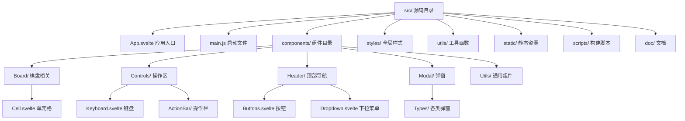
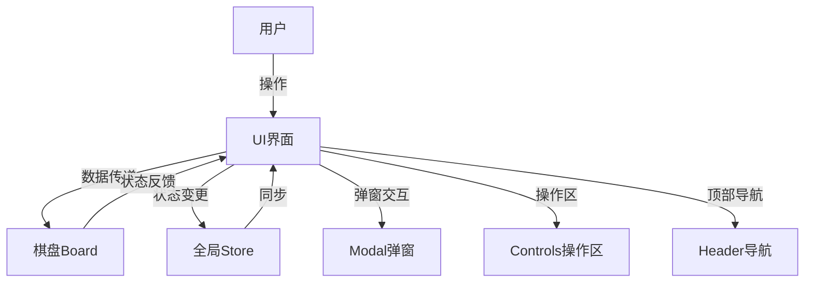
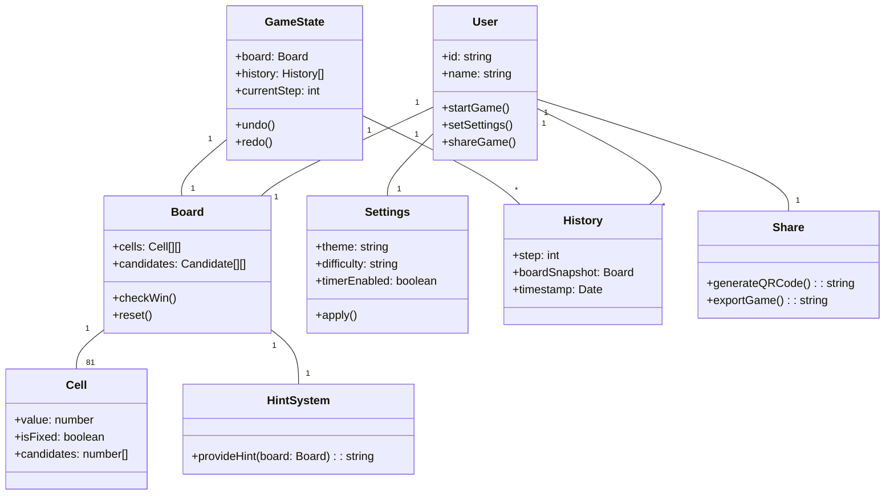

# 架构分析

## 一、技术栈与依赖

本项目基于现代前端技术栈，旨在实现高效、响应式的数独游戏体验。

- **Svelte**：作为主前端框架，Svelte 采用编译型思想，将声明式组件编译为高效的原生 JavaScript 代码，极大提升了运行效率和开发体验。
- **TailwindCSS**：原子化 CSS 框架，便于快速构建响应式、现代化界面，减少冗余样式代码。
- **Rollup**：现代 JavaScript 打包工具，支持 tree-shaking、代码分割等优化，结合 Svelte 插件实现高效打包。
- **PostCSS 及相关插件**：用于 CSS 预处理、自动前缀、压缩优化等。
- **@mattflow/sudoku-solver**：第三方数独求解器库，负责核心解题算法。
- **fake-sudoku-puzzle-generator**：用于生成数独题目的工具库。
- **svelte-preprocess**：支持 Svelte 组件的多种预处理能力（如 PostCSS、TypeScript 等）。
- **自动化部署**：通过 GitHub Actions 实现持续集成与自动化部署。

依赖管理采用 npm，所有依赖均在 package.json 中声明，便于团队协作和环境一致性。

## 二、项目结构

项目采用分层与组件化设计，结构清晰，便于维护和扩展。

- `src/`：主源码目录，包含所有业务逻辑和界面组件。
  - `App.svelte`：应用入口，负责页面整体布局、全局状态挂载、弹窗管理等。
  - `main.js`：Svelte 应用启动文件，将 App 组件挂载到 DOM。
  - `components/`：UI 组件目录，按功能模块细分。
    - `Board/`：棋盘及单元格相关组件，负责数独主界面渲染与交互。
    - `Controls/`：操作区组件，包括数字键盘、操作栏（撤销、重做、提示）、计时器等。
    - `Header/`：顶部导航栏，包含难度选择、模式切换、入口按钮等。
    - `Modal/`：弹窗组件及其类型（如设置、欢迎、分享、提示、确认、游戏结束等）。
    - `Utils/`：通用小组件，如剪贴板、开关等。
  - `styles/`：全局样式文件，主要为 TailwindCSS 配置和自定义样式。
  - `utils/`：工具函数目录，封装棋盘操作、候选数处理等通用逻辑。
- `static/`：静态资源目录，包含图标、manifest、service worker、示例题库等。
- `scripts/`：构建后处理脚本，如 CSS 内联、文件 hash 重命名等。
- `doc/`：项目文档，记录需求、架构、测试、运维等内容。

### 项目结构可视化

*如上图，展示了项目的主要目录结构及核心组件的层级关系，便于理解源码组织方式。*

## 三、核心模块与组件划分

本项目核心功能通过模块化组件实现，各模块职责分明：

1. **棋盘模块（Board）**
   - 负责渲染 9x9 数独棋盘，管理单元格状态、候选数显示、用户输入等。
   - 支持高亮当前单元格、同区域/同行/同列、错误提示等交互。
   - 单元格（Cell）组件独立，便于复用和状态隔离。
2. **操作区模块（Controls）**
   - 包含数字键盘，支持数字输入、候选数模式切换。
   - 操作栏（ActionBar）集成撤销、重做、提示、计时等功能。
   - 通过 store 管理操作状态，保证交互一致性。
3. **弹窗模块（Modal）**
   - 统一管理所有弹窗类型（如设置、欢迎、分享、确认、游戏结束等）。
   - 支持弹窗动画、遮罩层、回调处理等。
4. **头部导航（Header）**
   - 提供难度选择、模式切换、进入自定义题目等入口。
   - 下拉菜单与按钮组件分离，便于扩展。
5. **工具与辅助（Utils）**
   - 封装剪贴板操作、开关按钮等通用功能，提升代码复用性。

## 四、数据流与状态管理

项目采用 Svelte 的响应式 store 进行全局状态管理，保证数据一致性和组件间高效通信。

- **棋盘数据（Board）**：以 9x9 二维数组形式存储，每个单元格为 Cell 对象，包含当前值、是否为初始数字、候选数等。
- **游戏状态（GameState）**：记录当前棋盘、历史操作（用于撤销/重做）、当前步数等。
- **设置（Settings）**：包括主题、难度、计时器开关等，支持用户自定义。
- **候选数与光标（Candidates & Cursor）**：用于辅助输入和交互体验。
- **弹窗与提示（Modal & Hint）**：通过 store 控制弹窗显示与内容。

数据流动方式：
- 用户操作通过 UI 组件触发事件，更新 store 中的状态。
- store 状态变化自动驱动相关组件更新，实现响应式界面。
- 组件间通过 props 传递局部数据，通过 store 共享全局状态。
- 历史记录机制支持撤销/重做，提升用户体验。

## 五、构建与部署

- **构建流程**：
  - 使用 Rollup 作为主打包工具，结合 svelte、postcss、tailwindcss 插件，实现 JS/CSS 的高效打包与优化。
  - 生产环境下自动压缩 JS/CSS，提取关键 CSS 并内联到 HTML，提升首屏加载速度。
  - 构建后脚本自动处理文件 hash、内联 critical CSS，优化缓存与性能。
- **部署方式**：
  - 采用 GitHub Actions 自动化部署，推送到主分支后自动构建并发布到 GitHub Pages。
  - 支持 PWA，包含 manifest 和 service worker，实现离线访问和安装到桌面。
  - 静态资源统一管理，便于 CDN 加速和缓存。

## 六、架构特点与优势

- **组件化开发**：所有功能均以独立组件实现，结构清晰，便于维护和功能扩展。
- **响应式数据流**：Svelte store 保证数据与界面实时同步，交互流畅。
- **高性能**：Svelte 编译优化、Rollup 打包、CSS 内联等手段提升性能，适合移动端和桌面端访问。
- **自动化构建与部署**：一键构建、自动部署，极大提升开发效率和上线速度。
- **良好用户体验**：支持多种游戏模式、自定义题目、撤销重做、候选数辅助等，满足不同用户需求。
- **易于协作**：文档完善，依赖清晰，便于团队协作和新成员上手。

## 七、可视化架构图

### 1. 系统整体流程图

*如上图，用户通过 UI 进行操作，UI 与棋盘、全局状态、弹窗、操作区、导航等模块交互，形成完整的前端数据流。*

- 用户通过界面进行各种操作（如填写数字、撤销、提示、设置等），UI 组件根据操作调用对应的业务逻辑。
- 棋盘模块负责数据渲染与交互，所有状态变更通过全局 Store 管理，保证数据一致性。
- 弹窗、操作区、导航等模块与 UI 紧密协作，提升整体交互体验。

### 2. 核心类结构图

*如上图，展示了用户、棋盘、单元格、游戏状态、设置、提示系统、历史记录、分享等核心类及其关系。*

- User 类代表玩家，拥有设置、棋盘、历史记录、分享等属性和方法。
- Board 类为棋盘，包含所有单元格和候选数，负责校验胜利、重置等操作。
- Cell 类为单元格，记录当前值、是否为初始数字、候选数等。
- GameState 管理棋盘和历史记录，实现撤销、重做等功能。
- Settings 管理主题、难度、计时器等用户偏好。
- HintSystem 提供智能提示。
- History 记录每一步操作快照。
- Share 支持二维码生成和导出功能。

---

本架构分析基于源码结构和相关配置文件整理，便于后续开发、维护和团队协作。
