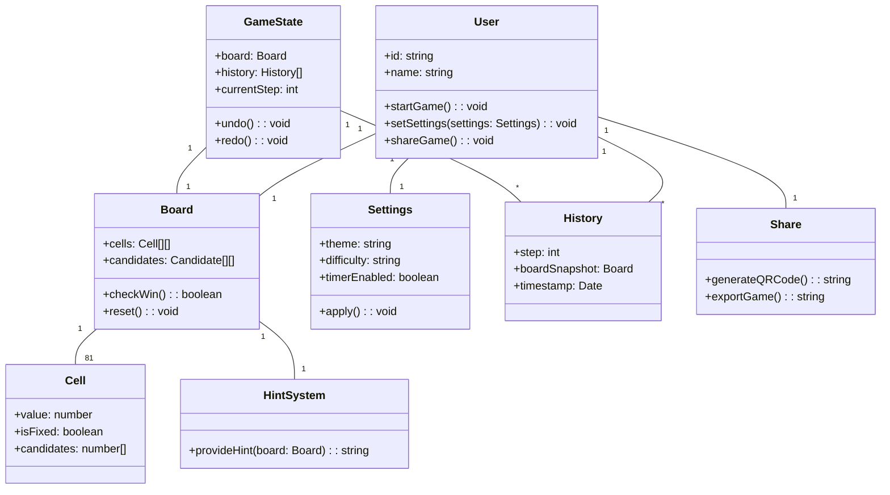
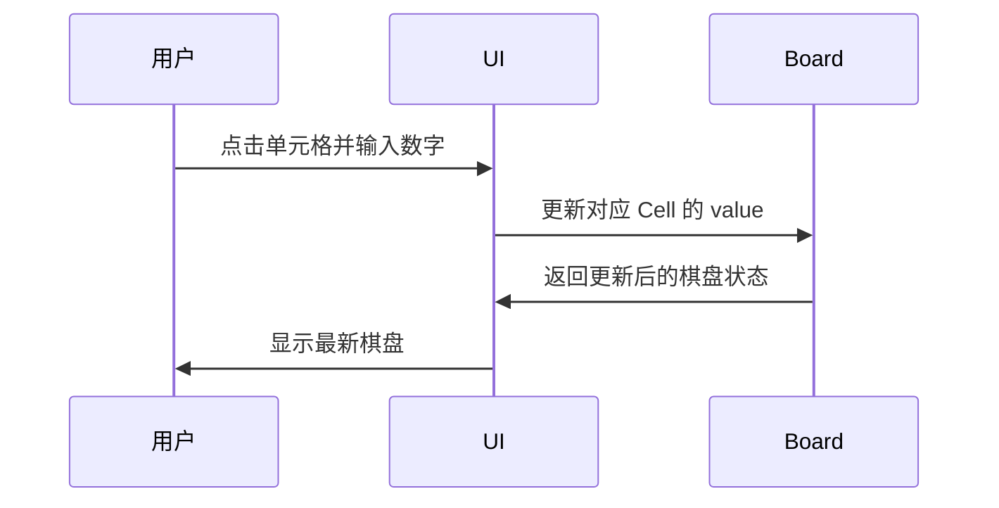
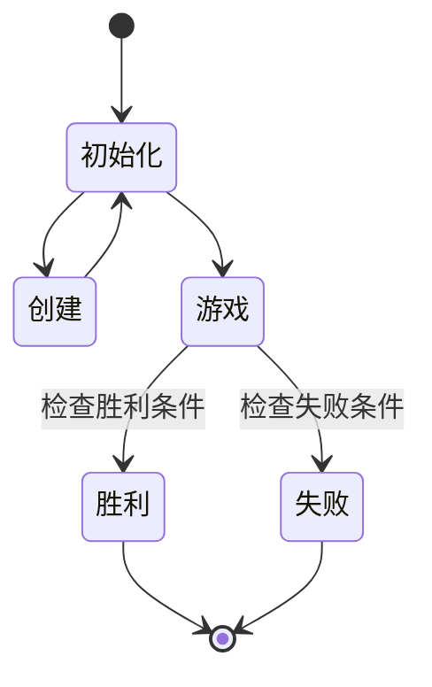

# 系统建模报告

## 一、用例图

```markdown

用户
    --> "开始新游戏" <-----
    --> "填写数字"        |
    --> "撤销操作"        |
    --> "重做操作"        |
    --> "查看提示"        |
    --> "设置游戏参数" ---|
    --> "分享或导出"

```

## 二、类图



## 三、序列图



## 四、状态图

### 游戏状态转换



# 

---

## 详尽文本说明

### 一、用例说明

本系统面向数独游戏玩家，主要用例包括：
- **开始新游戏**：用户可选择不同难度或自定义题目，系统初始化棋盘并进入游戏状态。
- **填写数字**：用户在棋盘上选择单元格并输入数字，系统校验输入的有效性并实时反馈。
- **撤销/重做操作**：用户可撤销或重做最近的操作，系统通过历史记录恢复或重现棋盘状态。
- **查看提示**：用户可请求系统提供解题提示，系统分析当前棋盘并给出建议。
- **设置游戏参数**：用户可调整主题、难度、计时器等参数，系统实时应用设置。
- **分享或导出**：用户可将当前题目或进度通过二维码、文本等方式分享给他人。

每个用例均以用户为中心，强调交互的便捷性和系统的响应性。

### 二、核心类说明

- **User（用户）**：代表游戏玩家，持有个人设置、历史记录等信息，负责发起游戏、调整设置、分享进度等操作。
- **Board（棋盘）**：核心数据结构，维护 9x9 单元格及候选数，负责校验输入、判断胜负、重置棋盘等。
- **Cell（单元格）**：棋盘的基本单元，记录当前值、是否为初始数字、候选数等属性。
- **GameState（游戏状态）**：管理棋盘快照、历史操作、当前步数，实现撤销/重做等功能。
- **Settings（设置）**：封装主题、难度、计时器等用户偏好，支持动态应用。
- **HintSystem（提示系统）**：根据当前棋盘状态智能分析并给出解题建议。
- **History（历史记录）**：记录每一步操作的棋盘快照和时间戳，便于回溯。
- **Share（分享）**：支持生成二维码、导出文本等多种分享方式。

各类之间通过组合与关联关系协作，保证数据一致性和功能完整性。

### 三、交互流程说明

用户与系统的主要交互流程如下：
1. 用户选择新游戏或导入题目，系统初始化棋盘。
2. 用户点击棋盘单元格并输入数字，UI 组件将输入传递给棋盘模块。
3. 棋盘模块校验输入，更新单元格状态，并将变更同步到全局状态。
4. 用户可随时撤销/重做操作，系统通过历史记录恢复对应状态。
5. 用户请求提示时，系统分析当前棋盘并返回建议。
6. 游戏完成后，系统弹窗提示胜利或失败，用户可选择重新开始或分享。

整个流程强调实时反馈、操作可逆和用户体验。

### 四、状态说明

系统状态主要包括：
- **初始化**：系统加载资源，准备棋盘和设置。
- **创建**：生成新棋盘或加载自定义题目。
- **游戏中**：用户进行数字填写、撤销、提示等操作。
- **胜利/失败**：系统根据棋盘状态判断游戏是否完成，进入终结状态。

状态间转换由用户操作和系统判定共同驱动，保证流程闭环和数据安全。

### 五、数据结构与一致性

- 棋盘数据采用二维数组，每个单元格为对象，便于扩展候选数、标记等属性。
- 历史记录采用快照机制，支持高效的撤销/重做。
- 设置和用户数据通过响应式存储，保证界面与数据同步。
- 所有关键操作均有异常处理和边界校验，提升系统健壮性。

---

本说明补充了系统建模的详细文本内容，帮助理解各部分设计思想与实现逻辑。
